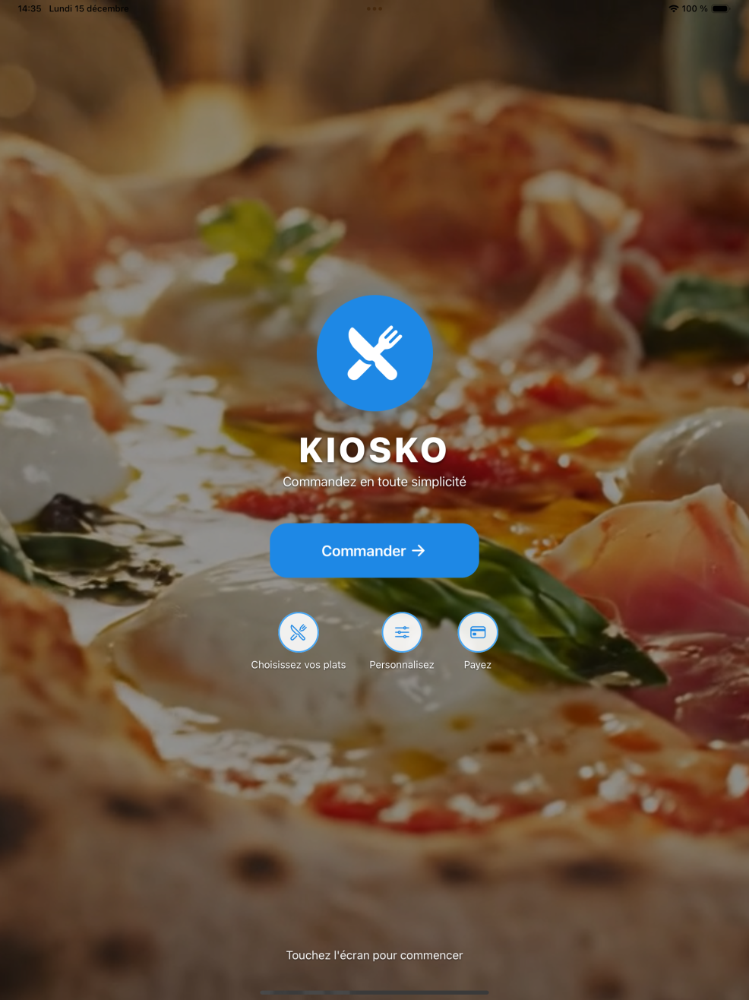
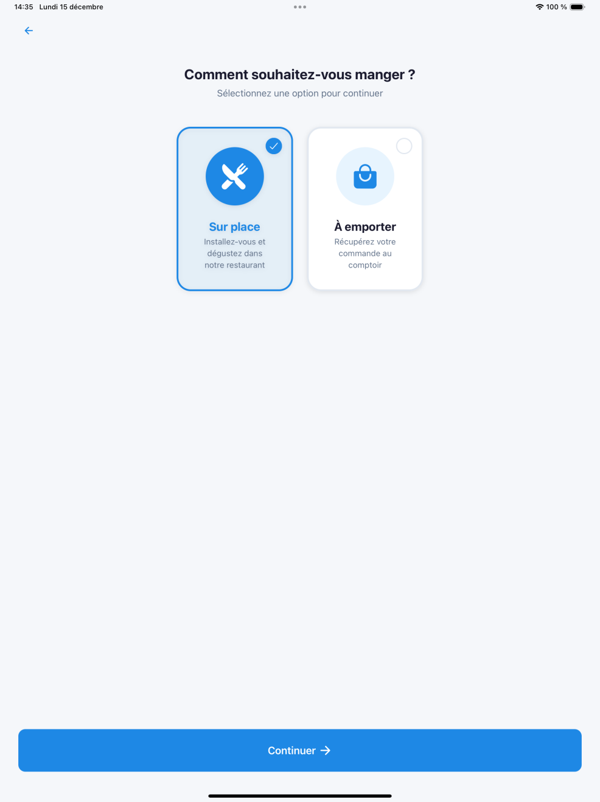
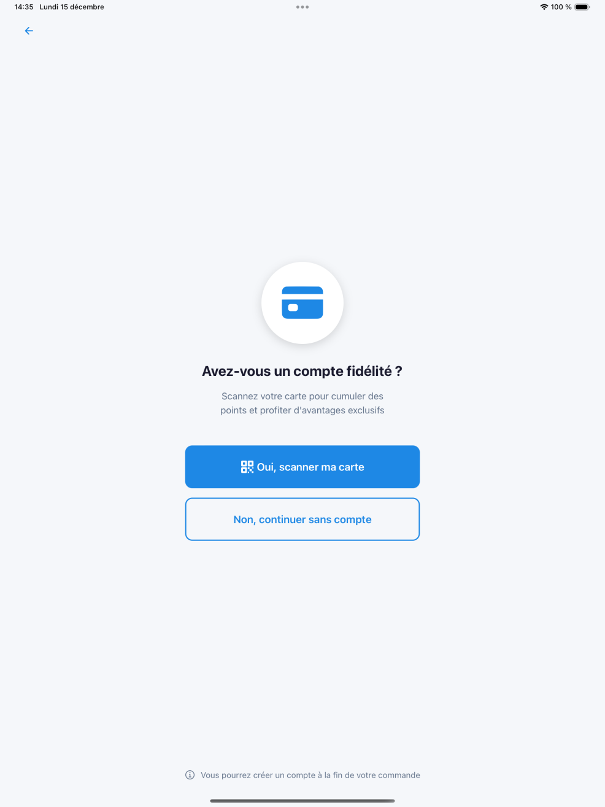
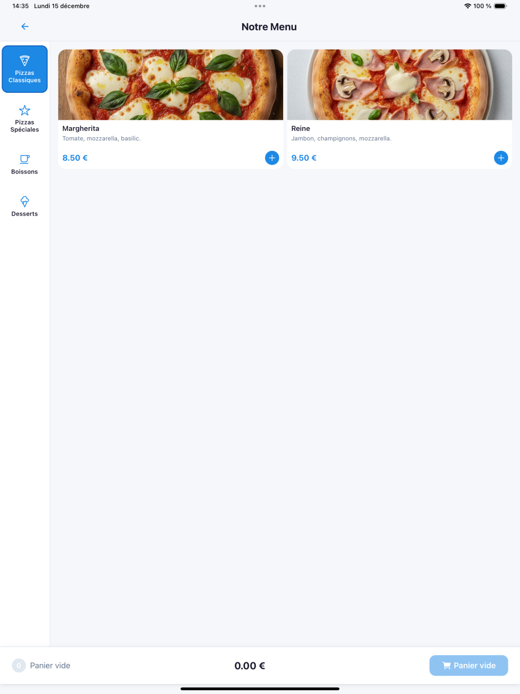
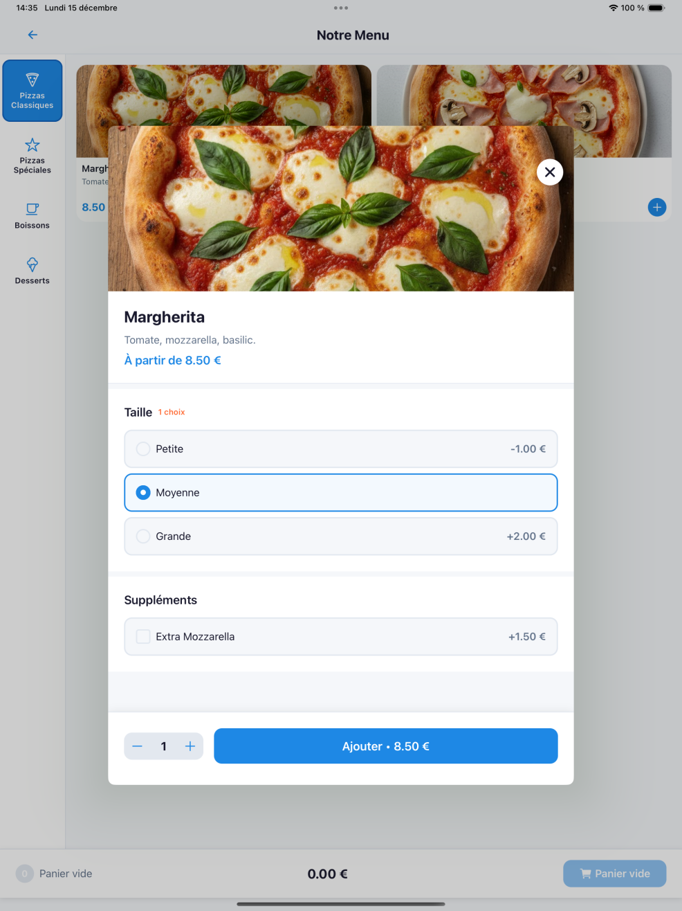
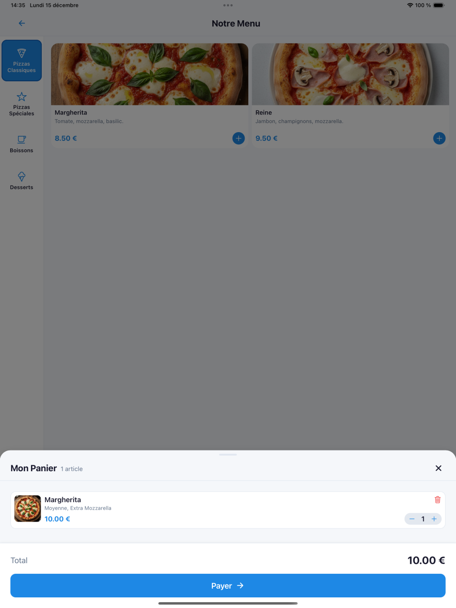
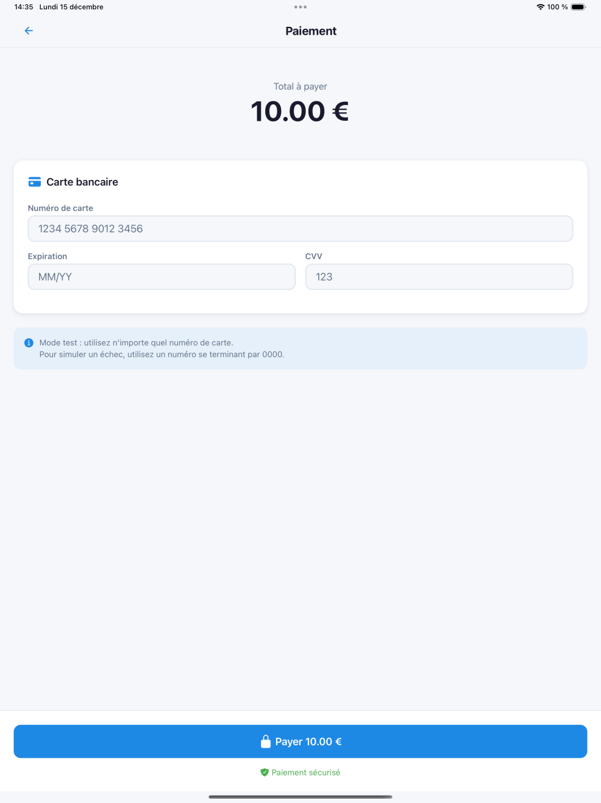
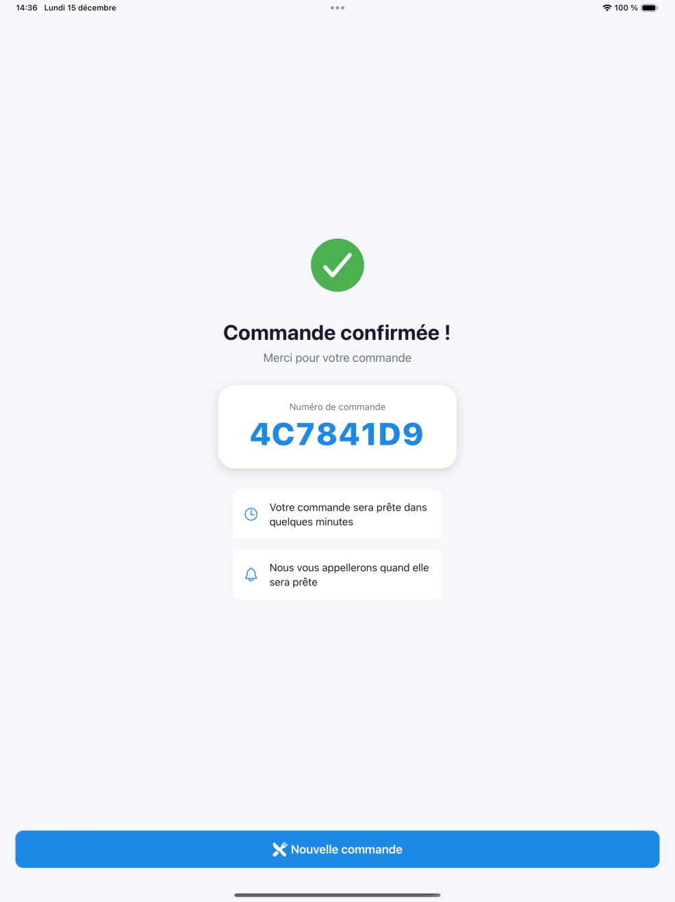

# 🍽️ Kiosko - Application de Commande Restaurant

Application React Native (Expo) de borne de commande pour restaurant, développée dans le cadre du cours de Développement Natif (Master 2).


---

## 📋 Architecture

L'application suit le pattern **MVVM (Model-View-ViewModel)** avec **Zustand** pour la gestion d'état :

```
┌─────────────────────────────────────────────────────────────┐
│                         VIEWS                                │
│  (app/*.tsx, components/*.tsx)                              │
│  Interface utilisateur React Native                          │
└─────────────────────┬───────────────────────────────────────┘
                      │ utilise
┌─────────────────────▼───────────────────────────────────────┐
│                     VIEWMODELS                               │
│  (viewmodels/*.ts)                                          │
│  Logique de présentation, hooks personnalisés               │
└─────────────────────┬───────────────────────────────────────┘
                      │ utilise
┌─────────────────────▼───────────────────────────────────────┐
│              STORES (Zustand) + SERVICES                     │
│  (stores/*.ts, services/*.ts)                               │
│  État global, appels API Supabase, composants natifs        │
└─────────────────────┬───────────────────────────────────────┘
                      │ utilise
┌─────────────────────▼───────────────────────────────────────┐
│                      MODELS                                  │
│  (models/*.ts, types/*.ts)                                  │
│  Interfaces TypeScript, structures de données               │
└─────────────────────────────────────────────────────────────┘
```

### Stack technique
- **Framework** : React Native avec Expo SDK 54
- **Navigation** : Expo Router (file-based routing)
- **State Management** : Zustand
- **Backend** : Supabase (PostgreSQL)
- **Langage** : TypeScript
- **Tests** : Jest

---

## 📁 Structure du Projet

```
kiosko/
├── app/                    # Écrans (Expo Router)
│   ├── index.tsx           # Écran d'accueil (vidéo background)
│   ├── dine-mode/          # Choix sur place / à emporter
│   ├── loyalty/            # Scan QR fidélité
│   ├── menu/               # Liste des produits
│   ├── product/[id].tsx    # Détail & personnalisation produit
│   ├── payment/            # Paiement (mocké)
│   └── confirmation/       # Confirmation commande
├── components/             # Composants réutilisables
├── viewmodels/             # Logique métier (MVVM)
├── stores/                 # Zustand stores
├── services/               # Services (API, haptics, etc.)
├── models/                 # Interfaces de données
├── types/                  # Types TypeScript partagés
├── utils/                  # Fonctions utilitaires
├── constants/              # Thème, couleurs
├── __tests__/              # Tests unitaires
├── assets/                 # Images, vidéos, fonts
└── .github/workflows/      # CI/CD GitHub Actions
```

---

## 🎯 Fonctionnalités Réalisées

| User Story | Description | Statut |
|------------|-------------|--------|
| **US1** | Parcourir le menu avec filtres par catégorie | ✅ |
| **US2** | Consulter les détails d'un produit | ✅ |
| **US3** | Personnaliser sa commande (taille, extras, options) | ✅ |
| **US4** | Gérer son panier (ajout, modification, suppression) | ✅ |
| **US5** | Scanner QR code de fidélité pour s'identifier | ✅ |
| **US6** | Paiement mocké (simulation) | ✅ |
| **US7** | Confirmation avec numéro de commande | ✅ |
| **Bonus** | Choix sur place / à emporter | ✅ |
| **Bonus** | Écran d'accueil avec vidéo animée | ✅ |

### Composants Système Natifs Utilisés

| Composant | Usage | Package |
|-----------|-------|---------|
| **Caméra** | Scan QR code fidélité | `expo-camera` |
| **Haptics** | Retours vibratoires (feedback tactile) | `expo-haptics` |
| **Video** | Vidéo d'accueil en boucle | `expo-video` |
| **AsyncStorage** | Persistance locale | `@react-native-async-storage/async-storage` |

---

## 🚀 Instructions de Lancement

### Prérequis
- Node.js **v22+**
- npm ou yarn
- Expo CLI (`npm install -g expo-cli`)
- iOS Simulator (macOS) ou Android Emulator

### 1. Cloner le projet
```bash
git clone https://github.com/itsmeMusic/kiosko.git
cd kiosko
```

### 2. Installer les dépendances
```bash
npm install
```

### 3. Configuration environnement
Créer un fichier `.env` à la racine :
```env
EXPO_PUBLIC_SUPABASE_URL=https://votre-projet.supabase.co
EXPO_PUBLIC_SUPABASE_ANON_KEY=votre-cle-anon
```

> 🔑 **Accès à la base de données** : Pour obtenir les variables d'environnement, merci de nous contacter en **MP sur Teams**.
>
> ⚠️ **Base de données indisponible ?** Si la DB Supabase est en pause ou down, contactez-nous également en **MP Teams** pour que nous puissions la remettre en route.

### 4. Lancer l'application
```bash
# Démarrer le serveur de développement
npm start

# Lancer sur iOS (simulateur)
npm run ios

# Lancer sur Android (émulateur)
npm run android
```

---

## 🎫 QR Codes de Test (Fidélité)

Pour tester la fonctionnalité de scan QR fidélité, utilisez ces deux comptes de test :

| QR Code | Compte |
|---------|--------|
|  | **Utilisateur Test 1** |
|  | **Utilisateur Test 2** |

> 💡 Scannez ces QR codes sur l'écran de fidélité pour vous identifier et accumuler des points.

---

## 🧪 Tests

L'application inclut des tests unitaires pour la logique métier :

### Tests disponibles
- **`__tests__/stores/cartStore.test.ts`** - Tests du store panier (ajout, suppression, calcul total)
- **`__tests__/utils/price.test.ts`** - Tests des calculs de prix (unitaire, total, points fidélité)
- **`__tests__/utils/validators.test.ts`** - Tests de validation
- **`__tests__/integration/cartValidation.test.ts`** - Tests d'intégration

### Lancer les tests
```bash
# Exécuter tous les tests
npm test

# Tests avec couverture
npm test -- --coverage

# Tests en mode watch
npm test -- --watch
```

---

## 🔄 CI/CD

Deux pipelines GitHub Actions séparés :

### `ci.yml` - Validation (sur Pull Request)

| Étape | Description |
|-------|-------------|
| **Install** | `npm ci` - Installation des dépendances |
| **Lint** | `npx expo lint` - Vérification du code |
| **TypeScript** | `npx tsc --noEmit` - Vérification des types |
| **Test** | `npm test` - Exécution des tests unitaires |

### `build.yml` - Build Web (sur push main)

| Étape | Description |
|-------|-------------|
| **Install** | `npm ci` - Installation des dépendances |
| **TypeScript** | `npx tsc --noEmit` - Vérification des types |
| **Build** | `npx expo export --platform web` - Export web |
| **Artifacts** | Upload du build (rétention 7 jours) |

> ⚠️ Le build ne se déclenche que si des fichiers de l'application sont modifiés (pas README, etc.)

---

## 📱 Captures d'écran

<!-- À compléter avec les screenshots -->

| Écran | Description |
|-------|-------------|
|  | Écran d'accueil avec vidéo |
|  | Choix sur place / à emporter |
|  | Scan QR fidélité |
|  | Liste des produits |
|  | Détail produit |
|  | Panier |
|  | Paiement |
|  | Confirmation |

---

## 📦 Générer un APK / Build

### Option 1 : Expo Go (développement)
Scanner le QR code affiché par `npm start` avec l'app Expo Go.

### Option 2 : Build EAS (production)
```bash
# Installer EAS CLI
npm install -g eas-cli

# Se connecter
eas login

# Build Android APK
eas build --platform android --profile preview

# Build iOS (nécessite compte Apple Developer)
eas build --platform ios --profile preview
```

### Option 3 : Build local
```bash
# Android
npx expo run:android --variant release

# iOS
npx expo run:ios --configuration Release
```

---

## 👥 Équipe

Projet réalisé dans le cadre du cours **Développement Natif** avec ❤️ par Louis et Théo - Master 2
